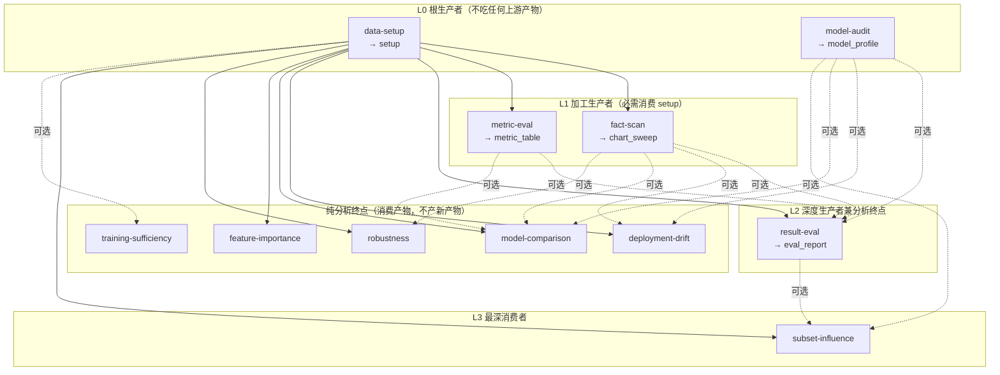

# ts-diagnose 引擎解析 v2

---

## 1. 从"六个平权场景"到"11 个分层 playbook"——发生了什么

v1 `ts-diagnose` 是这样的：6 个场景（model-comparison / fact-scan / training-sufficiency / robustness / feature-importance / deployment-drift）各自独立，每个都在自己的阶段 0 里重新做一遍"材料盘点 → 对齐 → 画图"。


|                       | 之前（v1，6 场景）                                              | 现在（v2，11 playbook 分层）                               |
| --------------------- | -------------------------------------------------------- | --------------------------------------------------- |
| 谁做对齐                  | 每个 playbook 阶段 0 各自做                                     | 只有 `data-setup` 做一次，产出 `setup`，其余全部复用               |
| 谁画标准图                 | fact-scan/model-comparison/deployment-drift 各自declare 一套 | `fact-scan` 专职扫一遍产 `chart_sweep`，其余按需可选复用或只画自己的核心子集 |
| model-comparison 声明的图 | 14 张                                                     | 5 张（对比核心集，其余通过 chart_sweep 可选复用）                    |
| result-eval 声明的图      | 11 张                                                     | 5 张                                                 |
| deployment-drift 声明的图 | 10 张                                                     | 4 张                                                 |
| 重复提问                  | 每个 playbook 各自问 freq/对齐键                                 | 归属 `data-setup`，下游禁止重复声明同一问题（加载期查重）                 |


---


## 每个golden 文件夹都作用：
 给分析脚本喂一份"答案已经手算好"的假数据，每次这份脚本被（重新）生成后，都必须先在这份假数据上跑一遍、核对算出来的数字是否等于手算的答案，算对了才准许拿去跑真实数据——不管这次写错是因为数据结构理解错还是公式逻辑写岔了，只要结果对不上已知答案，就直接拦下来不让碰真数据。

## 2. 产物机制：`produces` / `upstream` 怎么运作


### 2.1 声明

playbook frontmatter 里两个新字段（详见 `playbooks/_playbook-spec.md`）：

```yaml
produces:                # 本 playbook 是生产者
  id: setup               # 产物 id，引擎内唯一
  manifest: setup_manifest.json   # 机器契约文件（含输入指纹，驱动过期检测）
  marker_files: [predictions.csv] # 有效性核验：这些文件必须存在

upstream:                 # 本 playbook 消费哪些产物
  - product: setup
    required: true         # 缺 → orient 自动内联生产，不问用户
  - product: model_profile
    required: false        # 缺 → 三分支问用户
```


### 2.2 缺失时怎么裁决——机器裁决，不是模型自由发挥

orient 重扫工作目录，逐个上游产物核验状态，三种局面对应三种处理，**全部是脚本里的机械分支，不是"agent 觉得该怎么办"**：

- `required: true` **且缺失** → 打印 `⛔ 必需上游产物「X」缺失——主 agent 立即内联生产（不问用户）`：在 `<product-id>/` 子目录内完整跑一遍生产方 playbook 的正文，写回 `config.products.<id> = {workdir, status: built}`，再重跑 orient。
- `required: false` **且缺失** → AskUserQuestion 三分支：**现在内联生产** / **链接已有目录**（`status: linked`）/ **放弃**（`status: declined`，结论阶段必须声明"缺此产物、代价是什么"）。
- **已登记（built/linked）但输入变了** → `status: stale`，必须用户二选一：重建，或显式 `accept_stale: true` 留痕（结论须声明）。


### 2.3 加载期的四个静态守卫

playbook 一加载就查，不等运行时才发现问题：

1. 产物 id 全局唯一（两个 playbook 不能都声明 `produces.id: setup`）；
2. `upstream` 引用的产物 id 必须存在于某个 playbook 的 `produces.id`，拼错直接报错；
3. **依赖图无环**（`data-setup` 依赖 `fact-scan`、`fact-scan` 又依赖 `data-setup` 这种会被挡在加载期，不会留到运行时死锁）；
4. 一个问题（如 `freq`）只能被它所属的生产者声明，下游 playbook 重复声明同一 id 会加载期报错——这条堵死了"两套口径各问一遍、互相不知道对方问过"的隐患。

---


## 3. 11 个 playbook 到底怎么分层——一张有向图




实线 = `required: true`（缺就自动内联生产，不问用户）；虚线 = `required: false`（缺则三分支问）。

### 3.1 逐层怎么读

- **L0 根生产者**：`data-setup` 和 `model-audit` 不依赖任何产物，只吃原始材料（predict/truth，或 model_code）。它们是整张图唯一的"地基"。
- **L1 加工生产者**：`fact-scan`（画全套现象图 → `chart_sweep`）和 `metric-eval`（只算指标不归因 → `metric_table`）都必须先有 `setup` 才能跑，产出的东西又能被更上层复用。
- **L2 深度生产者兼分析终点**：`result-eval` 是全图里上游最多的一个——`setup` 必需，`model_profile`/`chart_sweep`/`metric_table` 全部可选复用；同时它自己也走到 `CONCLUSION.md`，还额外产出 `eval_report` 供下游用。
- **纯分析终点**：`deployment-drift`、`model-comparison`、`feature-importance`、`robustness`、`training-sufficiency` 只消费、不登记新产物，各自跑到自己的结论闸收尾。
- **L3 最深消费者**：`subset-influence` 是唯一一个跨过"生产者产物"边界去消费"分析产物"的 playbook——它把 `eval_report`（`result-eval` 的产出）列为可选上游，用来复用已有的评估口径而不必重新走一遍。


### 3.2 完整对照表


| playbook               | 产出产物            | 必需上游    | 可选上游                                         | 层级       |
| ---------------------- | --------------- | ------- | -------------------------------------------- | -------- |
| `data-setup`           | `setup`         | —       | —                                            | L0 根     |
| `model-audit`          | `model_profile` | —       | —                                            | L0 根     |
| `fact-scan`            | `chart_sweep`   | `setup` | —                                            | L1 加工    |
| `metric-eval`          | `metric_table`  | `setup` | —                                            | L1 加工    |
| `result-eval`          | `eval_report`   | `setup` | `model_profile`／`chart_sweep`／`metric_table` | L2 深度生产者 |
| `deployment-drift`     | —               | `setup` | `model_profile`／`chart_sweep`                | 终点       |
| `model-comparison`     | —               | `setup` | `model_profile`／`chart_sweep`／`metric_table` | 终点       |
| `feature-importance`   | —               | `setup` | —                                            | 终点       |
| `robustness`           | —               | `setup` | `chart_sweep`                                | 终点       |
| `training-sufficiency` | —               | —       | `setup`（可选）                                  | 终点，最弱耦合  |
| `subset-influence`     | —               | `setup` | `model_profile`／`eval_report`                | L3 最深消费者 |

---

## 4. 分层前后的具体差别——以 model-comparison 为例
Phase 1 试点轨迹
**之前**：`model-comparison` 自己声明 14 张图、5 个阶段；阶段 0 里要自己重新对齐 predict/truth，自己问一遍 `freq`/对齐键。

**现在**：大概流程
① 触发路由
用户说"为什么模型 A 比 B 好" → SKILL.md 里的场景描述匹配到 model-comparison，引擎载入这个 playbook 的 frontmatter + 正文。

② 前置产物检查
model-comparison 声明了 upstream: setup（必需）+ model_profile/chart_sweep/metric_table（可选）。orient.py 一看，发现必需的 setup 产物（整理好的长表+对齐报告）还没有 → 先内联跑一遍 data-setup 这个生产者 playbook 把数据整理出来，才允许往下走。

③ 材料与问题采集
确认 predict/truth 两份材料存在（必需），model_code 等是可选的。同时要答两个本目标特有的问题：考核口径是什么（默认 rmse_192）、这次对比哪些模型（没有默认值，必须回答）。

④ Stage 0 — 总差距事实
基于口径和模型对，算一份 gap_summary.json：谁的整体误差更低、差距有多大、这个差距在统计上显不显著（符号检验）。这一步只出数字，不下结论。

⑤ Stage 1 — 差距分解（画图看现象）
调用 chartbook 里 5 张预先声明好的图（worst-slice-compare、model-error-correlation、oracle-gap、horizon-degradation、cross-dim-stability），把"总差距"拆开看：差距是不是集中在某些片段/某个预测时效上。这一阶段只能写"现象"级别的话，禁止机制语言（不能说"因为 A 更懂夜间数据"这种归因）。做完强制停顿，向用户汇报现象清单。

⑥ 变体判断——要不要做机制归因
引擎检查用户有没有提供 model_code（模型代码）这份材料：
- 有 → 解锁 Stage 2，允许做"机制归因"
- 没有 → Stage 2 直接跳过，结论只能停留在"现象/排名"层面，不能瞎猜机制

⑦ Stage 2（可选）— 机制归因
如果有模型档案（model_profile 产物），把 Stage 1 的现象和模，把结论从"现象"升级到"假设"。

⑧ Stage 3 — 结论
这一步必须主 agent 亲自写（不能丢给 subagent），要先跑归因闸脚本核验证据链，再落盘 CONCLUSION.md，且必须产出 gate_reports/conclusion_gate.json 这个"通关回执"才算完成——没有这个回执，orient.py 判定这一阶

---

**一句话收尾**：v1 描述的是"每个诊断目标各自摸底画图归因"；v2 的真实状态是"一张产物有向图——廉价的对齐/档案/图谱/指标在底层生产一次，昂贵的深度归因在上层按需可选复用，required 的环节自动补上不用问、optional 的环节问清楚代价再决定要不要复用"。