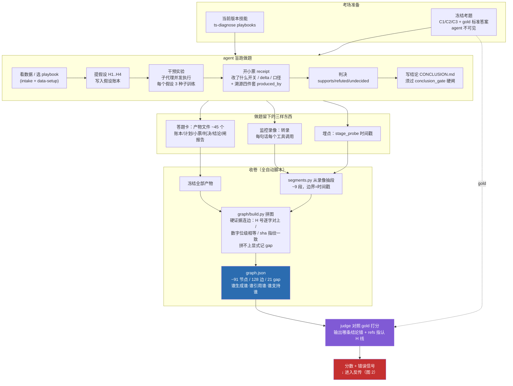
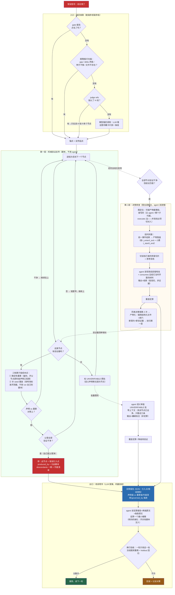

# 链路图：Rollout 与反传（2026-09-01）

## 图 1：Rollout 链路（做题 → 收卷 → 拼图 → 打分）

## 图 2：反传链路（锚定 → 第一层机械验证 → 第二层决策审查 → 改说明书）

## 两张图的接缝

- 图 1 的输出（graph.json + judge 错误信号）= 图 2 的输入；
- 图 2 出口"接受"后产生新版说明书 → 回到图 1 开始下一轮 rollout——这就是完整的进化循环；
- 图 2 里的虚线"验证器清单增长"是领土转移机制：决策产物化让脚本的地盘随轮次扩张，agent 的判断力收缩到真正开放性的残余上。
